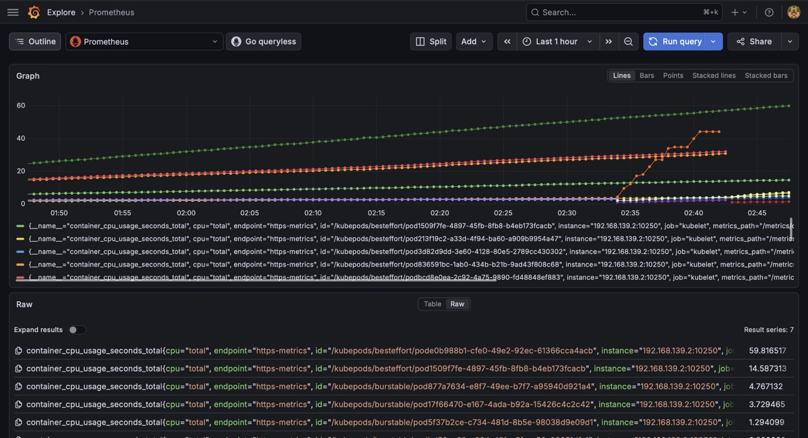

# ShopMicro: Production-Grade Microservices Platform

A robust, containerized microservices architecture deployed on Kubernetes, featuring automated monitoring, resource management, and high availability.

## 🏗️ Architecture
This platform consists of five core services designed for scalability and resilience:
* **Frontend**: React application (Vite) serving the user interface.
* **Backend**: Go/Python API handling business logic and database orchestration.
* **ML-Service**: Dedicated Python service for machine learning inference.
* **PostgreSQL**: Primary persistent relational database.
* **Redis**: High-speed caching layer for optimized performance.

## 🚀 Key Features (Project Requirements)

### Containerization & Orchestration (Requirement C)
* All services are containerized using Docker and hosted on Docker Hub.
* Orchestrated via Kubernetes with **High Availability** (2x replicas for frontend/backend).

### Production-Grade Monitoring (Requirement D)
* **Prometheus**: Automated metric collection from all pod endpoints.
* **Grafana**: Real-time visualization of cluster health, CPU utilization, and memory usage.
* **Resource Management**: Implemented strict CPU/Memory `requests` and `limits` to prevent OOM (Out of Memory) failures and ensure cluster stability.

### Self-Healing Infrastructure
* **Readiness Probes**: Implemented HTTP and TCP health checks to ensure traffic is only routed to healthy pods.
* **Automated Rollouts**: Zero-downtime deployments using Kubernetes' native rolling update strategy.

## 📊 Monitoring Dashboard

*Above: Grafana visualizing the `shopmicro` namespace with active resource monitoring.*

## 🛠️ Tech Stack
* **Orchestration**: Kubernetes (Orbstack/EKS)
* **Monitoring**: Prometheus & Grafana
* **Database**: PostgreSQL & Redis
* **CI/CD**: Git-based version control
